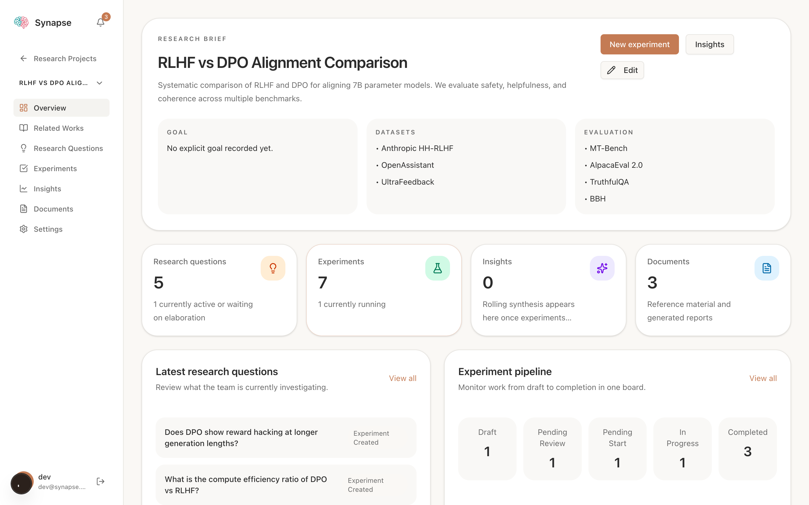
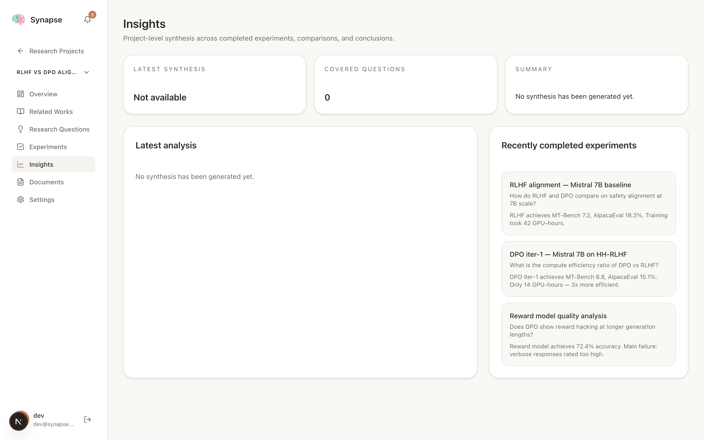

<p align="center">
  
</p>

<p align="center"><strong>面向人类研究者与 AI Agent 的研究编排平台</strong></p>

<p align="center"><a href="README.md">English</a></p>

Synapse 是一个研究编排平台，让人类研究者与 AI Agent 协同工作。它管理完整的研究生命周期，从文献综述、问题制定到实验执行与报告生成，内置 Agent 管理、算力编排和实时可观测性。

灵感来源于 [AI-DLC（AI 驱动开发生命周期）](https://aws.amazon.com/blogs/devops/ai-driven-development-life-cycle/) 方法论，构建于 [Chorus](https://github.com/Chorus-AIDLC/Chorus) 之上。

---

## 目录

- [Vibe Research](#vibe-research)
- [研究中 Agent 自主性的阶段](#研究中-agent-自主性的阶段)
- [功能特性](#功能特性)
- [快速开始](#快速开始)
- [进展](#进展)
- [研究工作流](#研究工作流)
- [文档](#文档)
- [许可证](#许可证)

## Vibe Research

<p align="center">
  
</p>

### 什么是 Vibe Research？

Vibe Coding 证明了人可以描述意图，让 AI 负责执行。**Vibe Research** 则把这种范式延伸到研究生命周期：

> **人类设定方向。Agent 执行、汇报、提议并迭代。人类审核、纠偏并做最终决策。**

Synapse 就是这个工作流的操作系统。它把项目上下文、文献、实验、算力访问、报告和协作统一到一个系统里，让研究可以以 agent 的速度推进，同时保留人类判断。

## 研究中 Agent 自主性的阶段

<p align="center">
  
</p>

Synapse 的愿景，是有节奏地推动研究团队穿越这些阶段。

- **把 Stage 1 做顺**：让实验执行、算力调度、结果沉淀和报告生成变成默认工作流，而不是一串手工交接。
- **让 Stage 2 变可靠**：把上下文、论文、实验、进度和评审放在同一个系统里，让 Agent 可以在明确边界内独立推进，而不轻易跑偏。
- **让 Stage 3 可实现**：提前搭好项目级委派所需的控制平面，包括结构化上下文、可观测性、编排能力、权限体系，以及关键节点上的人工 steering。

---

## 功能特性

### 项目工作空间

<p align="center">
  
</p>

Synapse 为每个研究项目提供统一的操作空间，承载项目简介、数据集、评估方法、研究问题、实验、报告和滚动综合分析。人类和 Agent 不再在文档、脚本、表格和聊天工具之间来回切换，而是在同一份上下文上协作。

### 相关文献与深度研究

<p align="center">
  
</p>

- **手动添加**：粘贴 arXiv 链接，自动获取论文元数据
- **自动搜索**：分配 `pre_research` Agent 持续搜索 Semantic Scholar
- **深度研究**：直接在项目内生成文献综述文档

### 实验执行看板

<p align="center">
  
</p>

- 五列实验流水线：`draft` → `pending_review` → `pending_start` → `in_progress` → `completed`
- Agent 执行实时状态：`sent`、`ack`、`checking_resources`、`queuing`、`running`
- 通过 `synapse_report_experiment_progress` 回传进度
- 当队列为空时支持 autonomous loop，由 Agent 提出下一批实验

### 算力与 Agent 运维

<p align="center">
  
</p>

- 独立的 `/agents` 页面，支持四种可组合权限：`pre_research`、`research`、`experiment`、`report`
- 基于 API Key 的 Agent MCP 访问方式
- 算力池、节点盘点、GPU 预留，以及项目级算力池绑定
- 通过托管访问包让 Agent 安全连接计算节点

### 报告、综合分析与 MCP 能力

- Agent 在项目语境里自动撰写实验报告，而不是套固定模板
- Synapse 会持续维护项目级综合分析文档
- 60+ MCP 工具覆盖项目上下文、文献检索、实验执行、算力访问与协作

## 快速开始

<p align="center">
  
</p>

### Docker 快速启动

```bash
git clone https://github.com/Vincentwei1021/Synapse.git
cd Synapse

export DEFAULT_USER=admin@example.com
export DEFAULT_PASSWORD=changeme
docker compose up -d
```

打开 [http://localhost:3000](http://localhost:3000) 登录。

### 本地开发

前提：Node.js 22+, pnpm 9+, PostgreSQL

```bash
cp .env.example .env
# 编辑 .env 配置 DATABASE_URL

pnpm install
pnpm db:push
pnpm dev

open http://localhost:3000
```

### 连接 AI Agent

#### 方式一：OpenClaw（推荐）

```bash
openclaw plugins install @vincentwei1021/synapse-openclaw-plugin
```

然后在 OpenClaw 设置中配置 `synapseUrl` 和 `apiKey`。

#### 方式二：Claude Code 插件

```bash
claude
/plugin marketplace add Vincentwei1021/Synapse
/plugin install synapse@synapse-plugins
```

设置环境变量：

```bash
export SYNAPSE_URL="http://localhost:3000"
export SYNAPSE_API_KEY="syn_your_api_key"
```

#### 方式三：手动 MCP 配置

在项目根目录创建 `.mcp.json`：

```json
{
  "mcpServers": {
    "synapse": {
      "type": "http",
      "url": "http://localhost:3000/api/mcp",
      "headers": {
        "Authorization": "Bearer syn_your_api_key"
      }
    }
  }
}
```

## 进展

<p align="center">
  
</p>

### 已实现

- 以项目为中心的研究工作空间，统一承载实验、文档、相关文献和滚动综合分析
- 可组合的 Agent 权限体系，带用户级所有权、API Key 和 Agent Session 可观测性
- 带实时执行状态、进度回传和结果文档更新的实验看板
- 基于 Semantic Scholar 的相关文献搜索、论文入库和深度研究报告生成
- 覆盖算力池、GPU 资产、池绑定、预留和访问包的算力编排能力
- 当实验队列空转时继续推进研究的 autonomous experiment proposal loop
- 覆盖项目上下文、文献、实验、算力和协作的 MCP 工具面

### 计划中

- **Steer 正在运行的 Agent**：在 `in_progress` 的实验过程中直接纠偏、补充指令或修正错误，而不是等整轮跑完再返工
- **实验日志实时回传**：把运行中的 job log 与高层 progress update 区分开，持续回传到实验面板中查看
- **Git tree 并行实验执行**：参考 Karpathy `autoresearch` 的思路，让实验在隔离的 git tree 或 worktree 中并行展开，便于对比与回收
- **更强的评估闭环**：把 baseline、指标和 accept/reject criteria 做成一等能力，让 Agent 在提出下一步之前先更扎实地比较结果
- **更完整的可复现追踪**：把代码版本、配置、产物和环境信息挂到实验上，方便审计与复跑
- **更稳的长任务控制**：增强跨机器、跨 GPU、长时间运行实验的重试、恢复和监督能力

## 研究工作流

<p align="center">
  
</p>

```
研究项目 ──> 研究问题 ──> 实验 ──> 报告
   ^            ^          ^        ^
  人类       人类或       AI Agent  AI Agent
  创建       AI Agent     执行并    撰写
  项目       提出         上报进度  分析报告
```

四种 Agent 权限角色（可组合）：

| 权限 | 职责 |
|------|------|
| **预研** | 文献检索，通过 Semantic Scholar 发现相关论文 |
| **研究** | 提出研究问题，假设构建 |
| **实验** | 执行实验，分配算力，上报进度 |
| **报告** | 生成实验报告、文献综述、综合分析文档 |

**自主闭环**：当所有实验队列为空时，指定的 Agent 自动分析项目全局上下文并提出新实验供人类审核。

---

## 文档

| 文档 | 说明 |
|------|------|
| [CLAUDE.md](CLAUDE.md) | 开发指南与编码规范 |
| [Architecture](docs/ARCHITECTURE.md) | 技术架构 |
| [MCP Tools](docs/MCP_TOOLS.md) | MCP 工具参考 |
| [OpenClaw Plugin](docs/synapse-plugin.md) | 插件设计与 Hooks |
| [Docker](docs/DOCKER.md) | Docker 部署指南 |

---

## 许可证

AGPL-3.0 — 见 [LICENSE.txt](LICENSE.txt)
