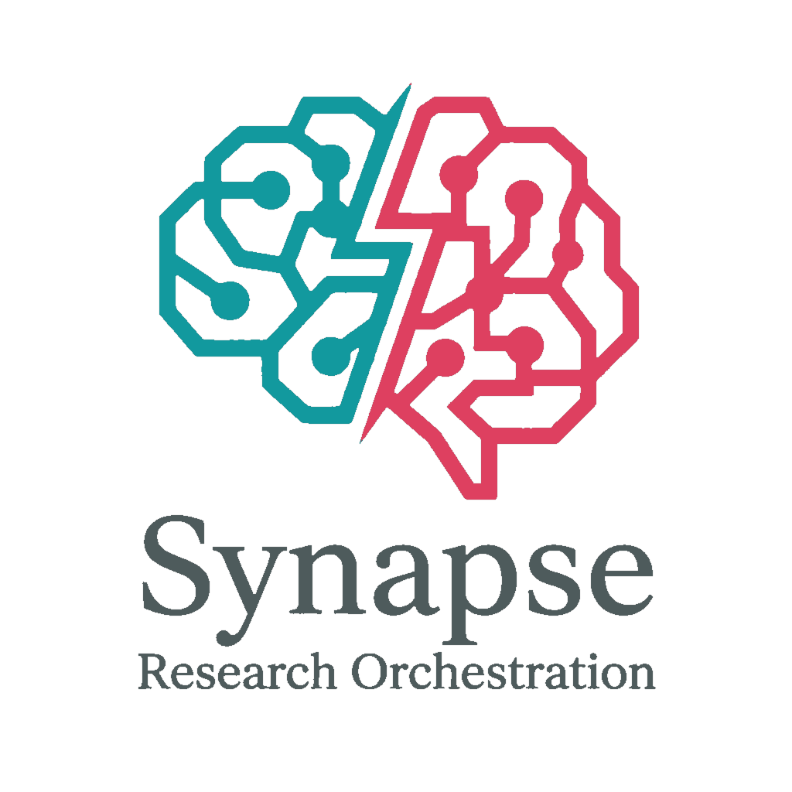
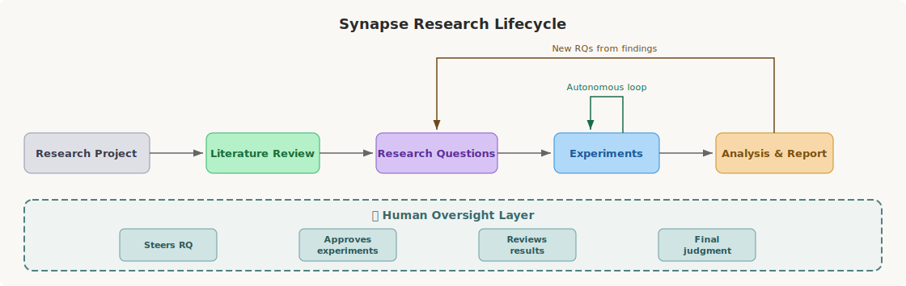
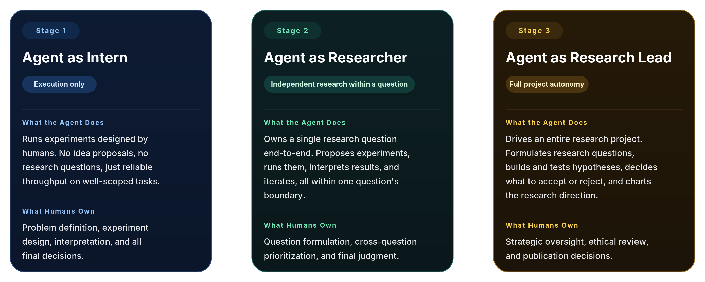
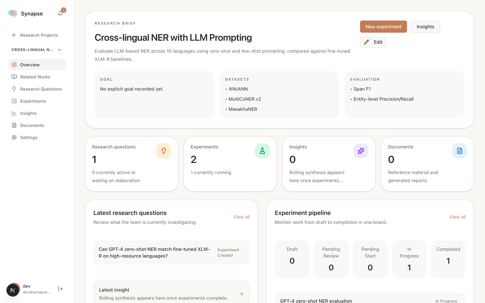
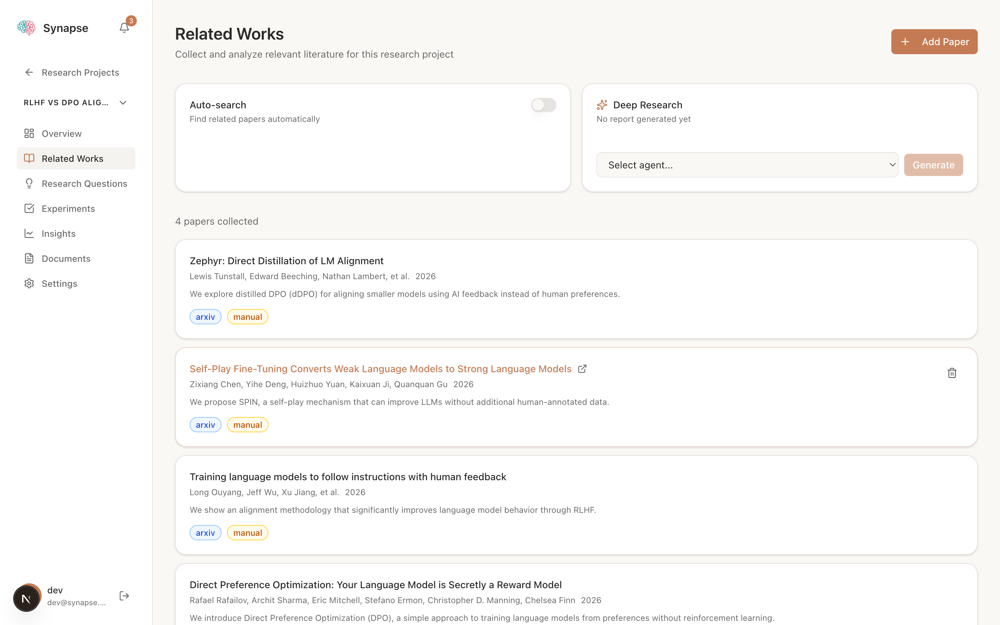
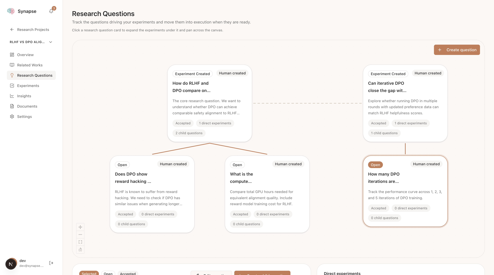
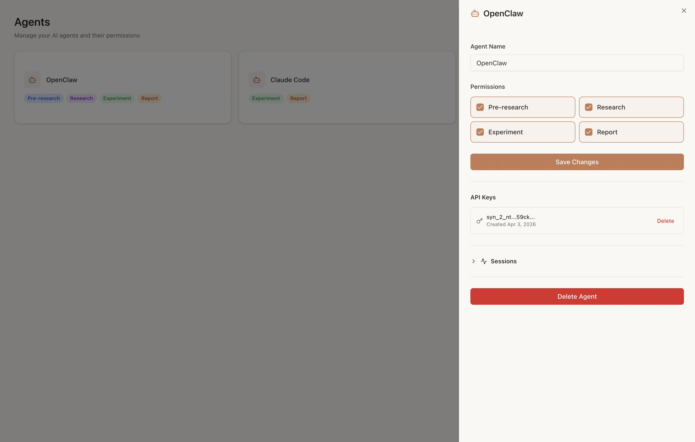
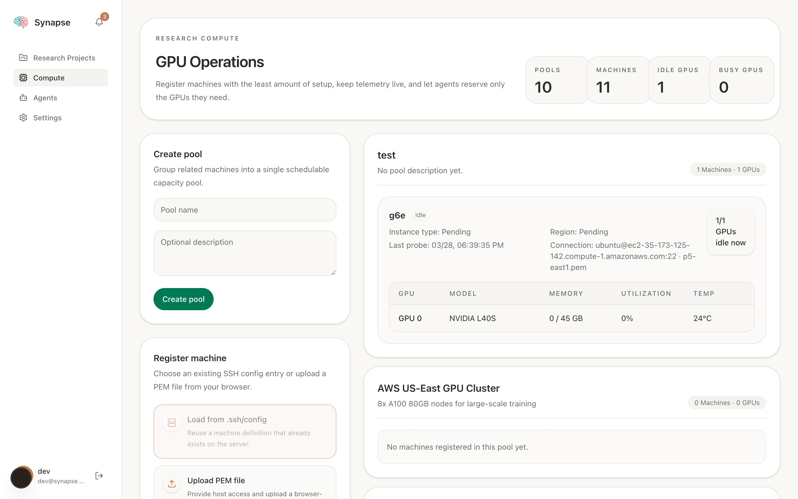

<p align="center">
  
</p>

<p align="center"><strong>面向人类研究者与 AI Agent 的研究编排平台</strong></p>

<p align="center"><a href="README.md">English</a></p>

Synapse 是一个研究编排平台，让人类研究者与 AI Agent 协同工作。它管理完整的研究生命周期，从文献综述、问题制定到实验执行与报告生成，内置 Agent 管理、算力编排和实时可观测性。

<p align="center">
  
</p>

灵感来源于 [AI-DLC（AI 驱动开发生命周期）](https://aws.amazon.com/blogs/devops/ai-driven-development-life-cycle/) 方法论，构建于 [Chorus](https://github.com/Chorus-AIDLC/Chorus) 之上。

---

## 🚀 最新动态

### v0.5.1 — [DeepXiv](https://github.com/DeepXiv/deepxiv_sdk) 集成 &nbsp; <sup>`2026-04-10`</sup>

| | |
|---|---|
| 🔍 **混合论文搜索** | 由 [DeepXiv](https://github.com/DeepXiv/deepxiv_sdk) 驱动（BM25 + 向量检索）— 替代 Semantic Scholar 和 OpenAlex |
| 📖 **论文全文阅读** | Agent 通过渐进式工具阅读真实论文：`brief` → `head` → `section` → `full` |
| 📝 **更智能的文献综述** | 深度研究报告现在能引用论文中的具体方法、实验结果和研究发现 |
| ⚙️ **令牌配置** | DeepXiv API 令牌可在 **设置 > 集成服务** 中配置 |

<details>
<summary><b>历史版本</b></summary>

### v0.5.0 — 自主循环与相关文献 &nbsp; <sup>`2026-03-29`</sup>
- 自主实验循环：Agent 提议 → 人类审核 → Agent 执行
- 相关文献页面：自动搜索、手动添加 arXiv URL、深度研究报告
- 实验实时状态追踪（sent/ack/checking/queuing/running）
- 按项目绑定算力池

</details>

---

## 目录

- [Vibe Research](#vibe-research)
- [功能特性](#功能特性)
- [快速开始](#快速开始)
- [进展](#进展)
- [文档](#文档)
- [许可证](#许可证)

## Vibe Research

### 什么是 Vibe Research？

Vibe Coding 证明了人可以描述意图，让 AI 负责执行。**Vibe Research** 则把这种范式延伸到研究生命周期：

> **人类设定方向。Agent 执行、汇报、提议并迭代。人类审核、纠偏并做最终决策。**

### 研究中 Agent 自主性的阶段

<p align="center">
  
</p>

Synapse 的愿景，是有节奏地推动研究团队穿越这些阶段。

- **把 Stage 1 做顺**：让实验执行、算力调度、结果沉淀和报告生成变成默认工作流，而不是一串手工交接。
- **让 Stage 2 变可靠**：把上下文、论文、实验、进度和评审放在同一个系统里，让 Agent 可以在明确边界内独立推进，而不轻易跑偏。
- **让 Stage 3 可实现**：提前搭好项目级委派所需的控制平面，包括结构化上下文、可观测性、编排能力、权限体系，以及关键节点上的人工 steering。

---

## 功能特性

### 项目工作空间

<p align="center">
  
</p>

Synapse 为每个研究项目提供统一的操作空间，承载项目简介、数据集、评估方法、研究问题、实验、报告和滚动综合分析。人类和 Agent 不再在文档、脚本、表格和聊天工具之间来回切换，而是在同一份上下文上协作。

### 相关文献与深度研究

<p align="center">
  
</p>

- **手动添加**：粘贴 arXiv 链接，自动获取论文元数据
- **自动搜索**：分配 `pre_research` Agent 持续搜索 Semantic Scholar
- **深度研究**：直接在项目内生成文献综述文档

### 研究问题画布

<p align="center">
  
</p>

- 以画布式层级结构组织研究问题与子问题
- 从探索、细化到创建实验与完成问题，持续追踪问题进度
- 让研究问题与对应实验、报告保持上下文连接

### 实验执行看板

<p align="center">
  
</p>

- 五列实验流水线：`draft` → `pending_review` → `pending_start` → `in_progress` → `completed`
- Agent 执行实时状态：`sent`、`ack`、`checking_resources`、`queuing`、`running`
- 通过 `synapse_report_experiment_progress` 回传进度
- 当队列为空时支持 autonomous loop，由 Agent 提出下一批实验

### Agent 管理

<p align="center">
  
</p>

- 基于 API Key 的 Agent MCP 访问方式
- 用户级 Agent 所有权、密钥管理和 Session 可观测性

五种 Agent 权限角色（可组合）：

| 权限 | 职责 |
|------|------|
| **预研** | 文献检索，通过 Semantic Scholar 发现相关论文 |
| **研究** | 提出研究问题，假设构建 |
| **实验** | 执行实验，分配算力，上报进度 |
| **报告** | 生成实验报告、文献综述、综合分析文档 |
| **管理** | 创建/删除项目、管理分组、审核研究问题 |

### 算力编排

<p align="center">
  
</p>

- 算力池、节点盘点、GPU 预留，以及项目级算力池绑定
- 通过托管访问包让 Agent 安全连接计算节点
- 让 Agent 在实验前、实验中和实验间都能基于可用资源运行

### 报告、综合分析与 MCP 能力

- Agent 在项目语境里自动撰写实验报告，而不是套固定模板
- Synapse 会持续维护项目级综合分析文档
- 70+ MCP 工具覆盖项目上下文、文献检索、实验执行、算力访问与协作

## 快速开始

### Docker 快速启动

```bash
git clone https://github.com/Vincentwei1021/Synapse.git
cd Synapse

export DEFAULT_USER=admin@example.com
export DEFAULT_PASSWORD=changeme
docker compose up -d
```

打开 [http://localhost:3000](http://localhost:3000) 登录。

### 本地开发

前提：Node.js 22+, pnpm 9+, PostgreSQL

```bash
cp .env.example .env
# 编辑 .env 配置 DATABASE_URL

pnpm install
pnpm db:push
pnpm dev

open http://localhost:3000
```

### 连接 AI Agent

#### 方式一：OpenClaw（推荐）

```bash
openclaw plugins install @vincentwei1021/synapse-openclaw-plugin
```

然后在 OpenClaw 设置中配置 `synapseUrl` 和 `apiKey`。

> **提示：** 如果遇到 `Request timed out before a response was generated`，请在 OpenClaw 配置中增大空闲超时：将 `agents.defaults.llm.idleTimeoutSeconds` 设为 `300`。

#### 方式二：Claude Code 插件

```bash
claude
/plugin marketplace add Vincentwei1021/Synapse
/plugin install synapse@synapse-plugins
```

设置环境变量：

```bash
export SYNAPSE_URL="http://localhost:3000"
export SYNAPSE_API_KEY="syn_your_api_key"
```

#### 方式三：手动 MCP 配置

在项目根目录创建 `.mcp.json`：

```json
{
  "mcpServers": {
    "synapse": {
      "type": "http",
      "url": "http://localhost:3000/api/mcp",
      "headers": {
        "Authorization": "Bearer syn_your_api_key"
      }
    }
  }
}
```

## 进展

### 已实现

- [x] 以研究项目为中心的工作空间，统一承载简介、数据集、评估方法、实验、文档和滚动综合分析
- [x] 研究问题层级与画布式问题管理
- [x] 带实时执行状态和进度回传的五阶段实验看板
- [x] Agent 自动生成实验报告与项目级综合分析文档
- [x] 基于 Semantic Scholar 的相关文献搜索、论文入库和深度研究报告
- [x] `pre_research`、`research`、`experiment`、`report`、`admin` 五种可组合 Agent 权限
- [x] 用户级 Agent 所有权、API Key 和 Agent Session 可观测性
- [x] 算力池、节点盘点、GPU 预留和项目级池绑定
- [x] 用于安全访问算力节点的托管访问包
- [x] 在实验队列空转时继续推进研究的 autonomous experiment proposal loop
- [x] 评论、提及、通知以及基于 SSE 的实时更新
- [x] 覆盖上下文读取、文献、实验、算力和协作的 70+ MCP 工具

### 计划中

- [ ] 在 `in_progress` 实验过程中直接 steer 正在运行的 Agent
- [ ] 将底层实验日志与高层进度分离，并实时回传到面板
- [ ] 通过隔离的 git tree / worktree 并行运行实验
- [ ] 用一等能力支持 baseline 与 accept/reject criteria
- [ ] 追踪代码版本、配置、产物和环境等可复现信息

---

## 文档

| 文档 | 说明 |
|------|------|
| [CLAUDE.md](CLAUDE.md) | 开发指南与编码规范 |
| [Architecture](docs/ARCHITECTURE.md) | 技术架构 |
| [MCP Tools](docs/MCP_TOOLS.md) | MCP 工具参考 |
| [OpenClaw Plugin](docs/synapse-plugin.md) | 插件设计与 Hooks |
| [Docker](docs/DOCKER.md) | Docker 部署指南 |

---

## 许可证

AGPL-3.0 — 见 [LICENSE.txt](LICENSE.txt)
